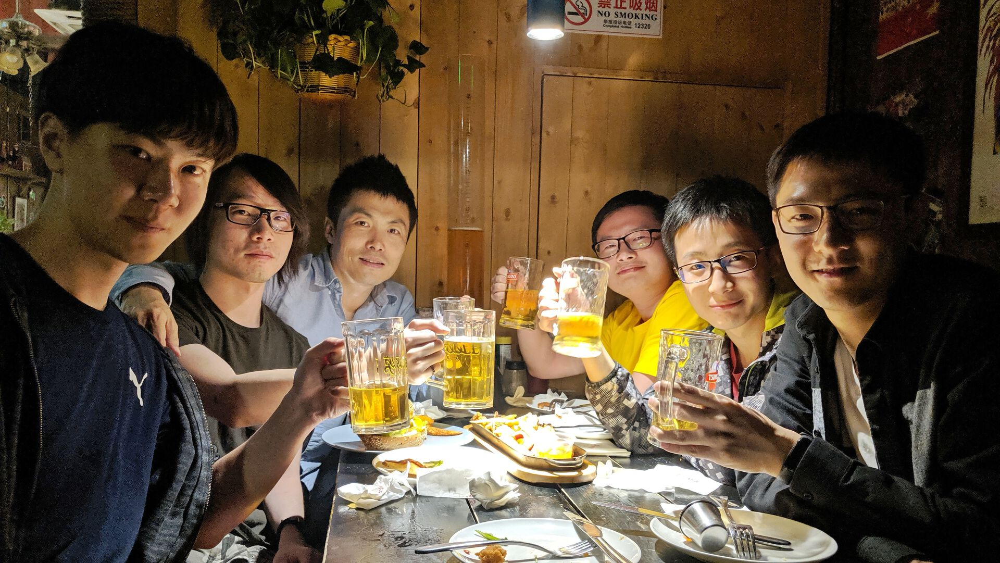

# AI ML CLUB

[](https://colab.research.google.com/drive/1AO3bwIgzfy63ty8OSSgUPRG1PIii3oo_)
[](https://github.com/bupt/awesome-cad)
[](https://travis-ci.com/BUPT/ai-ml.club)

Welcome to Artificial Intelligence & Machine Learning CLUB!

Here are all of friends for Code, Paper, and Beers! 🍻

- Paper Index: <https://ai-ml.club/papers>
- Meetup Announcements & Minutes: <https://ai-ml.club/categories/#events>
- Newcomer Manual: <https://ai-ml.club/manuals/newcomer/>

## JOIN US 💖

We have weekly offline meetups, you will be welcome to join if you are interested.

Only one step is needed before you join:

1. **Learn how to become a newcomer by reading [Newcomers Manual](https://github.com/BUPT/ai-ml.club/wiki/Newcomer-Manual)**

Then you are set. we are looking forward to see you in the next meetup!


> [第十一次沙龙：朱正源Oral](https://github.com/BUPT/ai-ml.club/issues/28)


> [第十二次沙龙：李童俊Poster](https://github.com/BUPT/ai-ml.club/issues/31)


> [第七次沙龙：会员合影](https://github.com/BUPT/ai-ml.club/issues/16)


> [第十九次沙龙：第一界年会](https://github.com/BUPT/ai-ml.club/issues/44)


> [第二季第10次俱乐部 After Party: Beers at Lakers Bar](https://ai-ml.club/events/seminar-meeting-minutes-2-10/)

## CONVERSATIONAL AI TUTORIALS

- [Neural Approaches to Conversational AI, July 8, 2018​](https://www.microsoft.com/en-us/research/publication/neural-approaches-to-conversational-ai/)
- [2017 Tutorial - Deep Learning for Dialogue Systems](https://www.slideshare.net/mlreview/2017-tutorial-deep-learning-for-dialogue-systems)
- [An Annotated Reading List of Conversational AI](https://medium.com/gobeyond-ai/a-reading-list-and-mini-survey-of-conversational-ai-32fceea97180)

## CHANLLENGES

- [Dialog System Technology Challenge (DSTC)](https://www.microsoft.com/en-us/research/event/dialog-state-tracking-challenge/)
- [The Conversational Intelligence Challenge 2 (ConvAI2, NIPS 2018 Competition, ongoing!)](http://convai.io/)

### Deep Learning Tutorials

- [吴恩达老师的深度学习课程笔记及资源](https://github.com/fengdu78/deeplearning_ai_books)

### Reinforcement Learning

- [强化学习从入门到放弃的资料](https://github.com/wwxFromTju/awesome-reinforcement-learning-zh)

### ChatBot Tutorials

- [自己动手做聊天机器人教程](https://github.com/warmheartli/ChatBotCourse)
- [零基础系列教程：如何开发微信聊天机器人并集成深度人工智能应用](https://github.com/telescopeuser/workshop_blog)
- [Natural Language Processing is Fun! - How computers understand Human Language](https://medium.com/@ageitgey/natural-language-processing-is-fun-9a0bff37854e)

## SLIDES

- [Deep Learning for Conversational AI, NAACL 2018 Tutorial, 1st June, 2018. New Orleans, USA.](https://www.poly-ai.com/naacl18)
- [Deep Learning for Dialogue Systems. COLING 2018 Tutorial](https://sites.google.com/view/deepdial/)
- [End-to-end Goal-oriented. Question Answering Systems. KDD 2018 Tutorial](https://sites.google.com/view/goal-oriented-qa/)
- [Speech and Language Processsing. Chapter 25: Conversational Agents. Stanford 2017](https://web.stanford.edu/~jurafsky/slp3/slides/convagents1.pdf)

## NLP

- [Microsoft Natural Language Processing Group](https://www.microsoft.com/en-us/research/group/natural-language-processing/)
- [Microsoft Research - Conversational Intelligence](https://www.microsoft.com/en-us/research/project/conversational-intelligence/#)
- [Tracking Progress in Natural Language Processing](https://github.com/sebastianruder/NLP-progress)
- [NLP Guide](https://nlpguide.github.io)
- [Speech and Language Processing (3rd ed. draft)](https://web.stanford.edu/~jurafsky/slp3/)

## PAPERS & CODES

- <https://github.com/ricsinaruto/Seq2seqChatbots/wiki/Chatbot-and-Related-Research-Paper-Notes-with-Images>
- <https://github.com/nicolas-ivanov/seq2seq_chatbot_links>
- [Neural Network Dialog System Papers](https://github.com/snakeztc/NeuralDialogPapers)

## DOMAIN

- [.BOT is an identity for bots.](https://www.amazonregistry.com/bot) - Currently, anyone who owns, operates or manages bots published using a supported tool (Amazon Lex, Botkit Studio, Dialogflow, Gupshup, Microsoft Bot Framework, and Pandorabots) can validate a bot and register a .BOT domain name.

## TOOLS

- [GitXiv — Collaborative Open Computer Science](http://www.gitxiv.com) - arXiv + Github + Links + Discussion
- [Web interface for browsing, search and filtering recent arxiv submissions](http://www.arxiv-sanity.com/library)

## Blog

We are using [GitHub Pages](https://pages.github.com/) to host our blog, powered by [Jekyll] with the nice and flexible two-column Jekyll theme [Minimal Mistakes](https://mmistakes.github.io/minimal-mistakes/).

### Install

```sh
# Setup ruby environment first
sudo apt install ruby
sudo gem install bundle

# Install the blog requirements
make install

# Install the NPM dependencies
npm install
```

### Serve

```sh
make serve
```

### Local Test

```sh
npm test
# If ERROR occurs please check out
# 1. node version >= 10
# 2. you have installed the lastest typescript
```

### Image Resizing

```sh
# Mac
brew install magicmagick

# Linux
apt install magicmagick

./script/fit-image.sh
```

### VsCode Markdown Linting

```shell
code --install-extension DavidAnson.vscode-markdownlint
```

Learn more from <https://github.com/DavidAnson/vscode-markdownlint>

### Rules

1. Attachments & Image files: all files need to be saved under the folder `docs/assets/2019/` (2019 is the current year), and you can expect the url of your file is under the url `https://ai-ml.club/assets/2019/`
1. Author Information: all the author information is saved in the file `docs/_data/author.yml`, please free free to add & modify it by yourself. See: <https://mmistakes.github.io/minimal-mistakes/docs/authors/>
1. Add a teasor image with size 500x300 to your post by add the following `YAML Front Matter` to your post:

    ```yaml
    header:
      teaser: /assets/2019/my-awesome-post-teaser-500x300.jpg
    ```

## MEMBERS

### Academic Chairman

- [Meina SONG](https://baike.baidu.com/item/%E5%AE%8B%E7%BE%8E%E5%A8%9C/4444673) Ph.D, Professor, School of Computer Science, BUPT
- [Da XIAO](https://scss.bupt.edu.cn/info/1063/1162.htm) 肖达，博士毕业于清华大学计算机科学与技术系，现为北京邮电大学网络空间安全学院讲师，彩云科技首席科学家，集智俱乐部核心成员。目前研究兴趣包括深度学习、人工智能、认知科学。曾在集智俱乐部发起并主持“脑与Deep Learning读书会”、“高级认知Deep Learning读书会”等线下活动。

### Rotating Chairperson

Chairman or Chairwoman are senior members who volunteered to help the club for managing the AMC seminar.

- AI ML Club Chairperson List: <https://github.com/orgs/BUPT/teams/chairs>
- Chairpersonal Manual: <https://ai-ml.club/manuals/chair/>

Require any chairperson for helping to add yourself to the chairs team on GitHub if you are a confirmed chairperson. (at least managed one AMC seminar as a rotating chairperson)

### Members

- AI ML Club Member List: <https://github.com/orgs/BUPT/teams/members>
- Member Manual: <https://ai-ml.club/manuals/member/>

Require any members for helping to add yourself to the member team on GitHub if you are a confirmed member. (at least presented one time at the AMC seminar)

## CO-FOUNDERS

- @huan - Huan LI (李卓桓), CS Ph.D, BUPT
- @824zzy - Yuan ZHU (朱正源), Master, BUPT

## Contributors

[](https://opencollective.com/ai-ml-club/)
[](https://opencollective.com/ai-ml-club/)

This project exists thanks to all the people who contribute. [[Contribute](CONTRIBUTING.md)].
<a href="https://github.com/BUPT/ai-ml.club/graphs/contributors"></a>

## Backers

[](#backers)

Thank you to all our backers! 🙏 [[Become a backer](https://opencollective.com/ai-ml-club#backer)]

<a href="https://opencollective.com/ai-ml-club#backers" target="_blank"></a>

## Sponsors

[](https://github.com/bupt/awesome-cad)
[](#sponsors)

The AI ML CLUB are sponsored by the professor [Meina Song](https://github.com/HoneyCatty) who's in charge of [CAD Center](https://github.com/bupt/cad) from [BUPT](https://github.com/bupt/) CS department. We really appreciate for letting us to use the great 821 meeting room in every sunday evening because it's very convenience for the members come from BUPT.

> “CAD欢迎大家，很荣幸能成为大家办活动的场地，也很高兴能跟各位才俊在一个社群。任何需要，联系我们。”  
> － [Meina SONG](https://github.com/HoneyCatty), professor of CAD Center, BUPT. [link](https://github.com/BUPT/ai-ml.club/issues/93#issuecomment-487449444)

Support this project by becoming a sponsor. Your logo will show up here with a link to your website. [[Become a sponsor](https://opencollective.com/ai-ml-club#sponsor)]

<a href="https://opencollective.com/ai-ml-club/sponsor/0/website" target="_blank"></a>
<a href="https://opencollective.com/ai-ml-club/sponsor/1/website" target="_blank"></a>
<a href="https://opencollective.com/ai-ml-club/sponsor/2/website" target="_blank"></a>
<a href="https://opencollective.com/ai-ml-club/sponsor/3/website" target="_blank"></a>
<a href="https://opencollective.com/ai-ml-club/sponsor/4/website" target="_blank"></a>
<a href="https://opencollective.com/ai-ml-club/sponsor/5/website" target="_blank"></a>
<a href="https://opencollective.com/ai-ml-club/sponsor/6/website" target="_blank"></a>
<a href="https://opencollective.com/ai-ml-club/sponsor/7/website" target="_blank"></a>
<a href="https://opencollective.com/ai-ml-club/sponsor/8/website" target="_blank"></a>
<a href="https://opencollective.com/ai-ml-club/sponsor/9/website" target="_blank"></a>

## COPYRIGHT & LICENSE

- Code & Docs © 2018-2019 Contributors
- Code released under the Apache-2.0 License
- Docs released under Creative Commons
